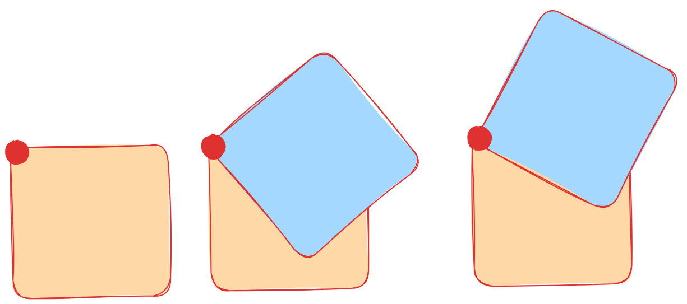
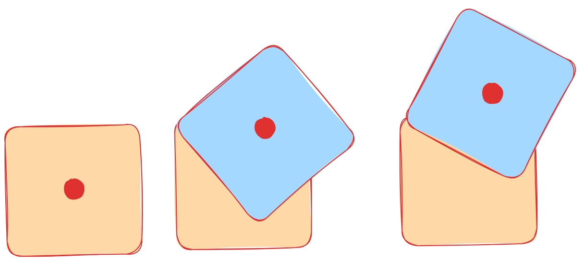
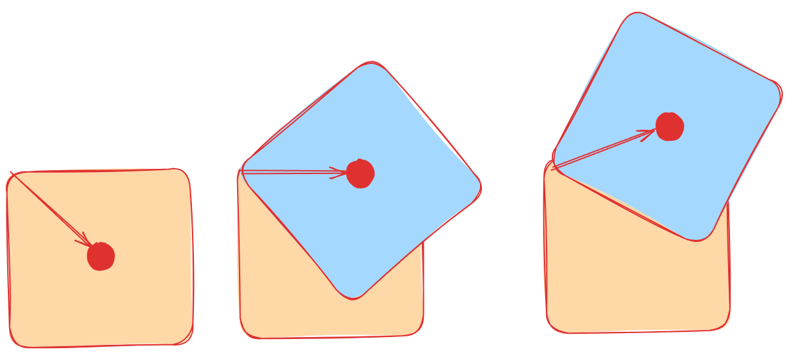
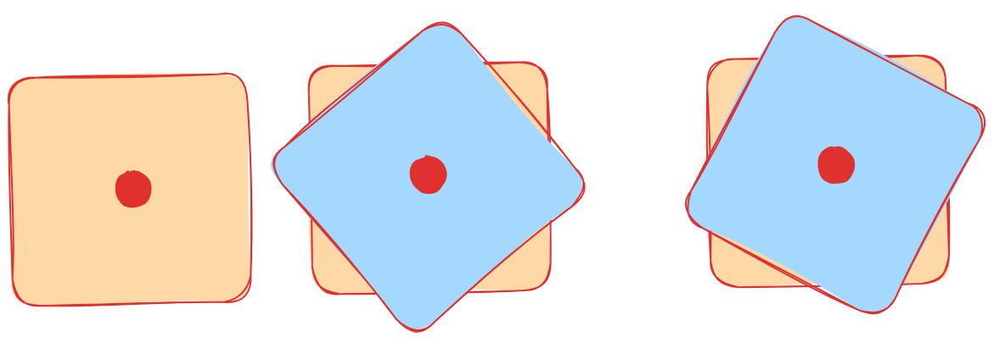

# CUDAatScaleForTheEnterpriseCourseProjectTemplate


## Project Description

This is a demonstration project which shows how to use [NppiRotate](https://docs.nvidia.com/cuda/archive/9.2/npp/group__rotate__.html) in such
a way that you get the image to rotate around its centre.

This was an interesting exercise to solve, because no real sample code ore examples exist for `NppiRotate`.  Working out how to set `nShiftX`, `nShiftY`
parameters so that the image spins around the centre took a bit of trigonometry.

Regarding specifics, the program takes a _black and white image_, and produces a set of rotations of that image.  

A helper script stitches them together using ImageMagick to create an animated looping GIF which continuously rotates.

We can consider the rotation around the origin (0, 0) in this following picture.



Next, let's condider where the centre of the image is actually tracking, 



To calculate the location of the red dot, first draw a line from the top left corner to the centre of the image, and calculate the angle of this line, and with the `atan()` function, and the length of the line with  Pythagoras theorem.  Then for each rotation, we can compute the location of where the centre is, using `cos` and `sin` functions.




Last of all, we measure how far away this red dot is from the centre, and we set the `nShiftX` and `nShiftY` parameters to this offset.  This corrects the location of the rotated image.



## Code Organization

```bin/```

```data/```

The data directory contains some examples of rotating gifs and their original sources.

```lib/```

The lib directory contains the Common directory from Nvidia cuda-samples

```src/```

The src directory contains the rotateNPP Makefile.

To build, run `make` within this directory.  It is required that `FreeImage` and the Cuda SDK is installed.

The build has been tested on Ubuntu Linux.

Note the project has been adapted from the box filter example, but is substantially different.

```INSTALL```
This file should hold the human-readable set of instructions for installing the code so that it can be executed. If possible it should be organized around different operating systems, so that it can be done by as many people as possible with different constraints.

```Makefile or CMAkeLists.txt or build.sh```
There should be some rudimentary scripts for building your project's code in an automatic fashion.

```run.sh```
An optional script used to run your executable code, either with or without command-line arguments.